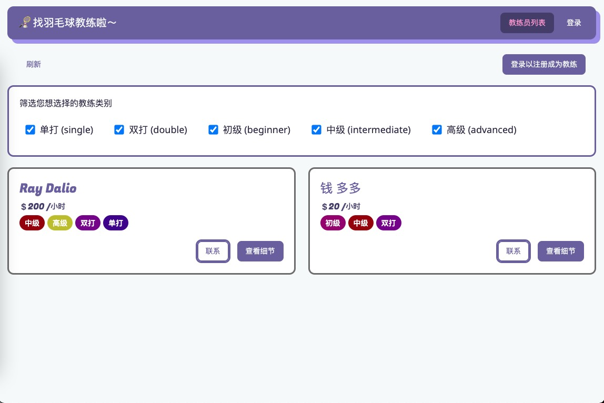

# 🏸 一个匹配羽毛球教练的小程序

> 使用 Vue + Vite, vue-router, vuex 进行开发

## 启动项目

- 进入项目目录，运行 `npm i` 下载所需要依赖包，即可使用该 Vite 项目。
- 注意：项目使用的数据库为 Firebase (Google Cloud Platform, GCP) 的 实时数据库 (realtime-database)

## 小程序基本使用 (basic usage)

### 主界面

