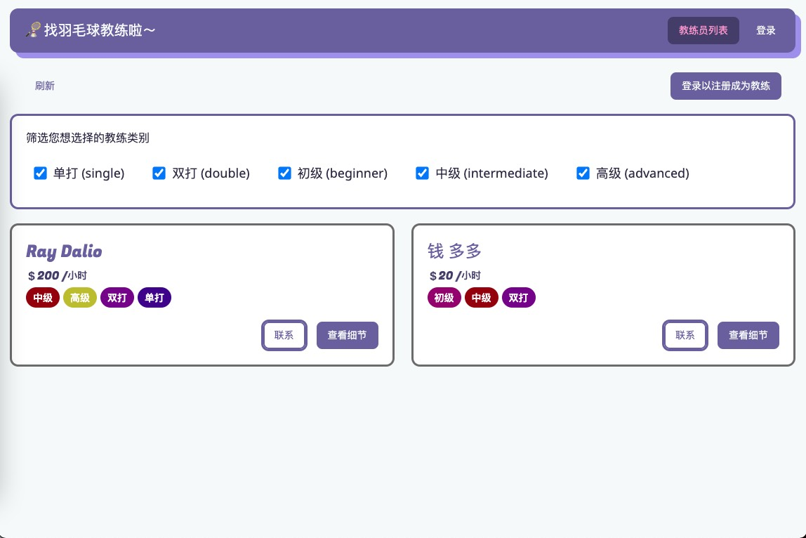
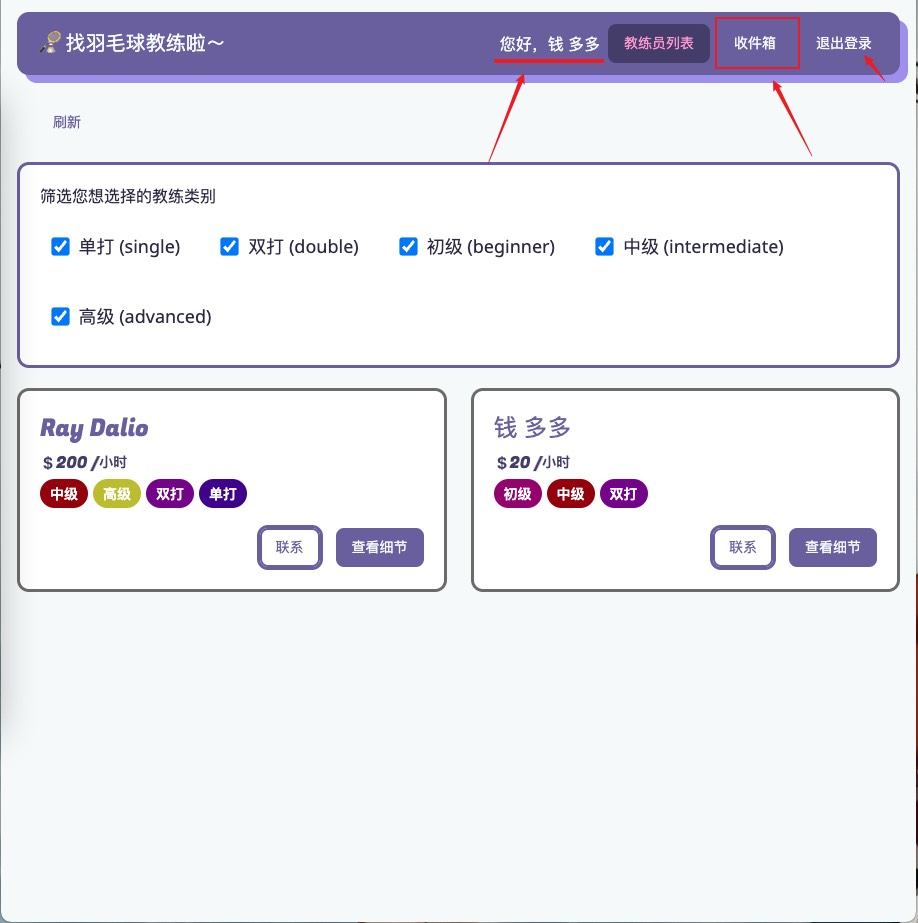
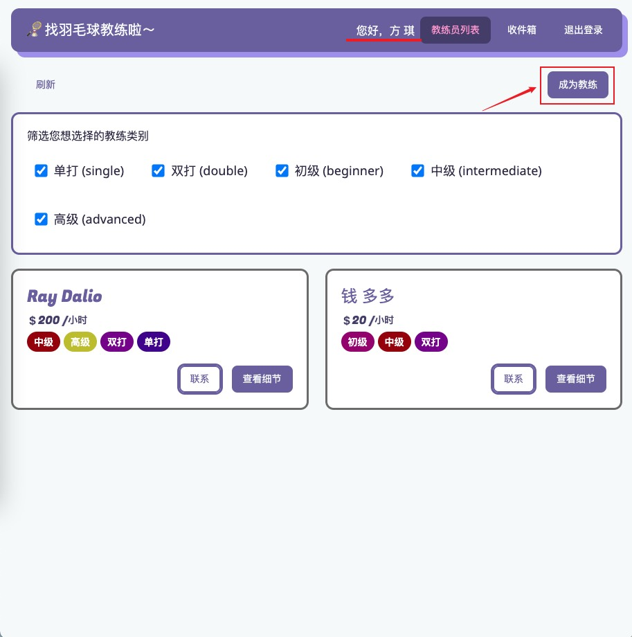
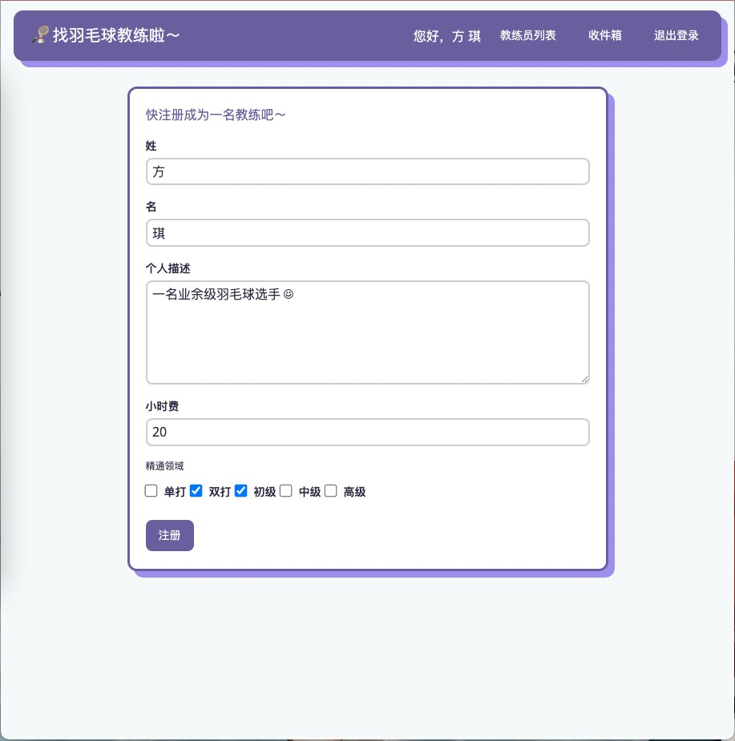
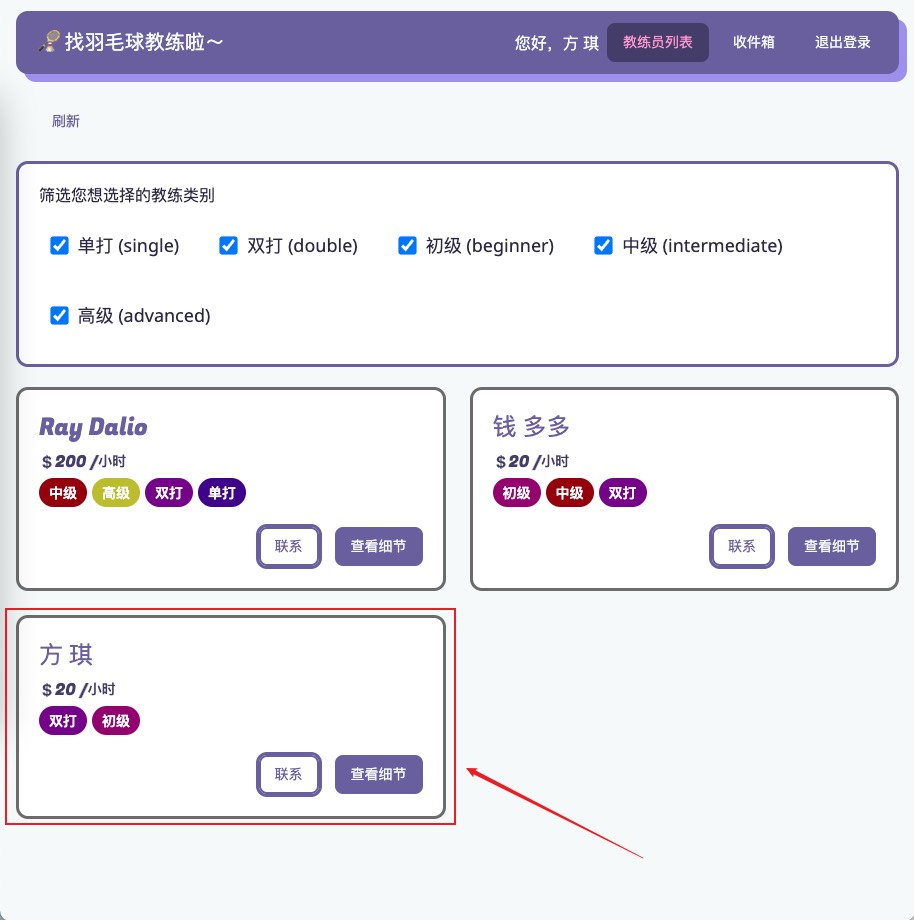

# 🏸 一个匹配羽毛球教练的小程序

> 使用 Vue + Vite, vue-router, vuex 进行开发

## 启动项目

- 进入项目目录，运行 `npm i` 下载所需要依赖包，即可使用本 Vite 项目。
- 注意：项目使用的数据库为 Firebase (Google Cloud Platform, GCP) 的 实时数据库 (realtime-database)。
- 使用 find-coach-auth 项目作为本项目的登录验证服务器。使用本小程序前，应先进入 find-coach-auth 项目目录，运行 `npm i`，打开本地的 mongoDB 服务器 27017 端口，然后即可使用本小程序正常的登录注册功能。

## 小程序基本使用 (basic usage)

### 未登录时界面

此时处于尚未登录状态，用户可以查看教练信息，但不能联系教练以及注册成为教练。

右上角的登录按钮可进行登录和注册。

查看教练列表时可以通过中间的过滤器进行筛选。

使用 find-coach-auth 为本小程序提供登录注册服务。

### 登录后界面

登录者用户名将展示在小程序顶部。

**钱 多多** 在登录小程序后注册成为了教练，因此他可以在收件箱收到用户发给他的咨询信息。

用户若未成为教练，可以在登录后填表成为教练，如用户 **方 琪** 的例子：

点击 **成为教练** 后即可开始填表：

点按 **注册** 成功后，教练员用户 **方 琪** 的信息被展示在教练员列表中，供用户进行选择联系：

